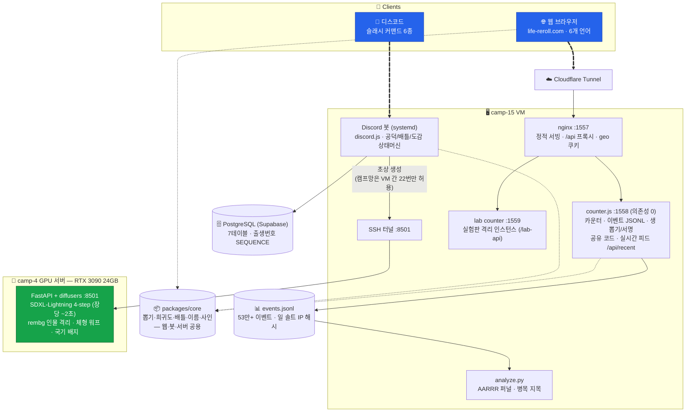
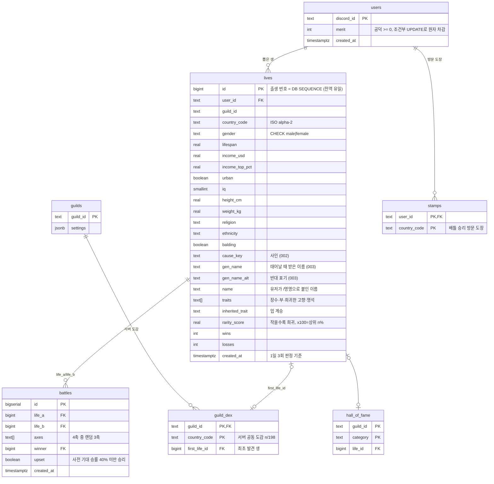

# 🌏 환생 시뮬레이터 (life-reroll)

## 🤼  팀원 소개

---

> **이서진**
> KAIST CS 21

> **[이름]**
> omok00 · [학교/학번 기입]

> **[이름]**
> grace0068 · [학교/학번 기입]

## 📖  프로젝트 소개

---

*(📸 `docs/notion-shots/card-result.png` — 결과 카드)*

**환생 시뮬레이터는 "다음 생"을 실제 지구 인구 분포 확률 그대로 뽑는 서비스입니다.**
버튼 한 번에 인도에서 17.9%, 한국에서 0.64%, 투발루에서 400만분의 1의 확률로 태어나 보세요.
웹(life-reroll.com)과 디스코드 봇, 두 곳에서 같은 확률 엔진으로 돌아갑니다.

> 🌐 **https://life-reroll.com** · 6개 언어 · 지금까지 **모두의 환생 640,000회+**

## 💭  기획 의도

---

*(📸 `docs/notion-shots/intro-full.png` — 결과 화면 전체)*

### "만약 다시 태어난다면"을
숫자로 만들어 본 적 있으신가요?

누구나 한 번쯤 상상하는 질문이지만, 대부분의 환생 콘텐츠는 상상에서 끝납니다.
저희는 이 질문에 **실제 데이터**로 답하고 싶었습니다.
당신이 인도에서 태어날 확률은 17.9%입니다. 미국은 4.2%, 한국은 0.64%.
모나코에서 태어나는 건 로또보다 어렵습니다 — **약 20만분의 1**.

가챠 게임의 'SSR' 같은 등급 대신 **확률 그 자체**를 보여줍니다.
"0.0003% · 약 32만 번 중 1번"이라는 숫자가 어떤 등급명보다 세기 때문입니다.
뽑힌 생에는 그 나라에서 그럴듯한 **이름**이 붙고, 키·소득·기대수명이 실제 국가 통계 분포에서
샘플링되며, 마지막에는 **사인(死因)**까지 — 하나의 완결된 삶이 카드 한 장에 담깁니다.

문제는 한 번 뽑고 끝나는 서비스가 되기 쉽다는 점입니다.
그래서 **수집(198개국 도감)·성취(칭호 42종)·경쟁(디스코드 배틀)·공유(결과 카드)**의
네 축으로 "한 번 더"를 설계했고, 모든 가설을 **자체 계측 → 측정 → 개선 루프**(개선 로그 24회)로
검증하며 만들었습니다.

> 실제 데이터가 주는 겸허함과 뽑기의 재미,
> 이 두 가지를 잇는 것이 **환생 시뮬레이터**의 목표입니다.

## ✨   주요 기능

---

#### 🎲 **실제 인구 분포 리롤**

> UN World Population Prospects 2024 기반 198개국 인구 누적분포에서 이분 탐색으로 나라를 뽑고, 그 나라의 실제 통계(도시화율·기대수명·1인당 GDP·평균 키·BMI·종교·민족 구성)에서 개인을 샘플링합니다. 결과는 12개 칩: **이름 · 성별 · 모국어 · 민족 · 종교 · 키 · 몸무게 · IQ · 사인 · 탈모 · 기대수명 · 연 소득**.

#### 📖 **198개국 환생 도감 & 칭호 42종**

> 태어나 본 나라가 도감에 쌓입니다. 완주는 사실상 불가능하므로(모나코 1/20만) 중간 목표를 잘게 쪼갰습니다 — 환생 횟수 7단계('첫 생'→'초월자'), 도감 6단계, 희귀도 3단계('우주가 봐준 생' 1/20만), 기록형 13종, 종교 16종·민족 312종 수집, 대륙별 탐험가/정복자. 대표 칭호는 직접 골라 상단에 걸 수 있습니다.

#### 🔮 **오늘의 환생 운세**

> 날짜+기기 시드로 하루 동안 같은 생이 나오는 일일 고정 롤. 매일 돌아올 이유를 만듭니다.

#### 📡 **실시간 환생 피드**

> "🇮🇳 인도에서 누군가 환생했습니다 · 방금" — 시뮬레이션이 아니라 **진짜 다른 사용자의 리롤**입니다. 서버가 실제 roll 이벤트만 링 버퍼에 담아 내려주고, 조용하면 조용한 대로 둡니다(가짜 이벤트로 채우지 않음). 60초 주기 자동 리롤 봇은 주기성 탐지로 걸러냅니다.

#### 🃏 **공유 3종**

> ① **결과 카드**(1080×1350 PNG) — 화면과 같은 소스로 그려 어긋남이 원천적으로 없음 ② **영혼 프로필** — 리롤하면 사라지는 한 판이 아니라 누적 도감·칭호를 자랑 ③ **6개 언어 OG 랜딩**(/en /ja /zh /es /pt) — 크롤러는 그 언어의 미리보기를 읽고, 사람은 언어가 심긴 채 앱으로 들어옵니다.

#### 🤖 **디스코드 봇 — 서버에서 함께 환생**

> 같은 확률 엔진(packages/core)으로 디스코드에서 뽑고, 모으고, 겨룹니다. 뽑힌 생마다 **RTX 3090이 그리는 치비 초상**이 붙습니다.

> 🌏
>
> **/환생**
> 1일 3회 뽑기, 공덕으로 추가. 업(특성) 계승 버튼

> 🛂
>
> **/여권**
> 생의 상세 정보 조회

> 🎴
>
> **/덱**
> 내 생 목록 + 최고 기록 3종

> ✍️
>
> **/명명**
> 내 생에 이름 붙이기

> 📖
>
> **/도감**
> 서버 공동 국가 컬렉션 n/198

> ⚔️
>
> **/배틀**
> 상대 수락 없는 비동기 대결

#### ⚔️ **배틀 — 4축 중 랜덤 3축, 3판 2선승**

> 축별 ±10% 랜덤 보정이 승부를 뒤집으면 "업셋" 연출. 수치적분으로 구한 사전 기대 승률 40% 미만의 승리는 **언더독 승리**로 공덕 +12. 이긴 상대 생의 국가에 방문 도장이 찍혀 도감 우회 수집로가 됩니다.

> ⏳
>
> **기대수명**

> 💰
>
> **연 소득**

> 🌏
>
> **모국 인구**

> 💎
>
> **희귀도**

#### 📊 **가설 → 계측 → 개선 루프 (24회)**

> 외부 분석 도구 대신 자체 track() 이벤트를 JSONL로 쌓고, analyze.py가 AARRR 퍼널(활성화율·D1 리텐션·바이럴 계수·병목 지목)을 출력합니다. 모든 기능 변경은 IMPROVEMENT_LOG에 **근거→개선→검증** 24행으로 기록했습니다. 예: 이모지 평가를 없애고 체류시간(dwell) 계측으로 대체 → "UI를 없앴는데 의견은 100% 수집".

## 📱  User Interface

---

> *(📸 `docs/notion-shots/ui-main.png`)*
>
> 🎲  **메인 — 리롤과 결과 카드**
>
>
> 버튼 한 번으로 새 생을 받습니다. 국기·나라·확률("이 생이 걸릴 확률 0.64%")과 12개 칩이 한 화면에.
> 인구 500만 미만의 희귀한 나라가 나오면 컨페티가 터집니다.

> *(📸 `docs/notion-shots/ui-dex.png`)*
>
> 📖  **환생 도감 (198칸)**
>
>
> 태어나 본 나라가 밝게 켜집니다. 진행률 바와 "다음 목표까지 N개국"이
> 가장 가까운 다음 칸을 항상 보여줍니다.

> *(📸 `docs/notion-shots/ui-titles.png`)*
>
> 🏅  **업적 · 칭호 (탭 4개: 칭호/기록/종교/민족)**
>
>
> 딴 칭호는 달성 조건이 상시 표시되고, 기록형은 마우스를 올리면 "내 기록 143"처럼
> 실제 달성값이 보입니다. 아무 칭호나 눌러 상단 대표로 고정할 수 있습니다.

> *(📸 `docs/notion-shots/ui-share.png`)*
>
> 🃏  **공유 시트 — 결과 카드 & 영혼 프로필**
>
>
> 클립보드·카카오·인스타 스토리·X·네이티브 공유. 카드는 화면 결과와 같은 코드로 그려
> 1080×1350 PNG로 저장됩니다. 링크는 짧은 코드(?s=Xa9k2p)로, 서버가 서명한 생만 복원됩니다.

> *(📸 `docs/notion-shots/ui-langs.png` — ko·en·ja 3장 몽타주)*
>
> 🌐  **6개 언어**
>
>
> 한국어·영어·일본어·중국어·스페인어·포르투갈어. 첫 방문 언어는 접속 국가(geo)로 자동 결정되고,
> 공유 링크도 언어별 미리보기(OG)가 따로 나갑니다.

> *(📸 디스코드에서 /환생 결과 직접 캡처 — 봇 화면은 자동 촬영 불가)*
>
> 🤖  **디스코드 /환생 — AI 초상과 함께**
>
>
> 임베드에 이름(현지 표기+로마자)·12개 스탯·희귀도(상위 N%)·LLM/템플릿 3문장 요약이 담기고,
> 그 생의 **치비 초상**(키·체형·탈모 반영, 실제 국기 배지)이 붙습니다. 결과는 항상 공개 —
> 서버에서 목격되는 것이 확산 엔진입니다.

> *(📸 디스코드에서 /배틀 결과 직접 캡처)*
>
> ⚔️  **디스코드 /배틀 중계**
>
>
> 축별 수치 비교와 승패, 업셋이면 "기울어 보이던 승부였다…" 패턴별 중계 문장.
> 언더독 승리 공덕 보상과 방문 도장이 함께 표시됩니다.

## 💻  Tech Stack

---

| **영역** | **기술** |
| --- | --- |
| **Web Frontend** | Vanilla JS (ES Modules) — 프레임워크·번들러 **0** |
| **Discord Bot** | TypeScript + discord.js v14 |
| **공용 로직** | `packages/core` — pnpm 모노레포, 웹·봇·서버가 같은 확률 엔진 공유 |
| **Backend** | Node.js 단일 프로세스 counter 서버 (**의존성 0**, API 9종) + nginx |
| **DB** | 웹: localStorage + JSONL 이벤트 로그 · 봇: PostgreSQL (Supabase) |
| **AI 이미지** | SDXL-Lightning 4-step + rembg (RTX 3090 24GB, FastAPI/diffusers) |
| **LLM 요약** | OpenAI 호환 인터페이스(선택) — 미설정 시 템플릿 폴백으로 완전 동작 |
| **인프라** | Cloudflare Tunnel · systemd 상주 5유닛 · SSH 터널(GPU 서버) |
| **분석** | 자체 track() → sendBeacon 배치 → analyze.py (AARRR) + GA4 |

- **무빌드 웹** — 정적 HTML + ES 모듈 33개. 빌드 파이프라인이 없어 배포는 파일 복사, 디버깅은 소스 그대로.
- **의존성 0 서버** — counter.js 하나가 카운터·이벤트 수집·생 뽑기/서명·공유 코드·실시간 피드를 담당. 공유 링크 위조를 막기 위해 **서버가 직접 생을 뽑아 서명**합니다(클라 서명은 키가 노출되므로 무의미).
- **모노레포 core** — 뽑기·희귀도·배틀·이름·사인 로직이 한 곳에. 서버와 브라우저가 **같은 빌드 산출물**을 import해 "서명은 통과하는데 분포가 다른" 버그를 원천 차단.
- **배포 전 실험판(lab)** — git worktree 기반 격리 실험판(localStorage·API·경로 3중 격리)에서 보고 채택/폐기. 칭호 시스템은 라이브 전에 5번 고쳐 채택.

## 💻  System Architecture

---

## 💻   DB Schema

---

웹은 서버에 개인 상태를 두지 않습니다(진행상황=localStorage, 계측=익명 JSONL).
아래는 **디스코드 봇**의 PostgreSQL 스키마입니다 — 모든 상태는 DB, 메모리는 캐시만(§A.4).

- Details

>     🎲
>
>      **Lives — 생 1회의 스냅샷**
>
>     : `lives`, `users`
>
>     출생 번호는 앱 레벨 max+1이 아니라 **DB SEQUENCE 전용** — 동시 뽑기에도 전역 유일합니다.
>     일일 3회 제한은 별도 카운터 없이 `created_at` 카운트로 판정하고,
>     공덕 차감은 조건부 `UPDATE ... WHERE merit >= cost` + 반환 행 수로 성공을 판정합니다(원자적).
>     이름은 두 층입니다 — 태어날 때 받은 생성 이름(`gen_name`, 결정론적)과 유저가 `/명명`으로 붙인 이름.

>     ⚔️
>
>      **Battle & Collection**
>
>     : `battles`, `stamps`, `guild_dex`, `hall_of_fame`
>
>     배틀은 비동기(상대 수락 불필요) — 축 추첨 후 각자 덱에서 축별 최적 생을 자동 선발하므로
>     "상대 덱을 보고 고르는" 후공 이점이 없습니다. 승리하면 패자 생의 국가에 방문 도장이 찍혀
>     개인 도감의 우회 수집로가 되고, 서버 단위 공동 도감(`guild_dex`)은 최초 발견자를 기록합니다.

>     🧩
>
>      **Stateless 컴포넌트**
>
>     버튼(업 계승·페이지네이션)의 custom_id에 `karma:<유저>:<특성>`처럼 상태를 인코딩해,
>     **봇을 재배포해도 이전 메시지의 버튼이 그대로 동작**합니다. 밸런스 수치는 전부
>     `packages/core/src/config.ts` 한 파일 — 미확정 값은 지어내지 않고 null + TODO(balance)로 표시합니다.

## 📊  숫자로 보는 프로젝트

---

| 지표 | 값 |
| --- | --- |
| 모두의 환생 횟수 | **640,000회+** |
| 수집된 계측 이벤트 | **534,000건+** (JSONL) |
| 지원 언어 | 6개 (ko·en·ja·zh·es·pt) |
| 국가 데이터 | 198개국 (UN WPP 2024 등) |
| 칭호/업적 | 42종 · 종교 16종 · 민족 312종 수집 |
| 개선 루프 기록 | IMPROVEMENT_LOG **24회** (근거→개선→검증) |
| 바이럴 계수 | 2.71 (공유 1건당 유입, 측정 시점 기준) |
| AI 초상 생성 속도 | 장당 ~2초 (RTX 3090, SDXL-Lightning 4-step) |

## 🙇‍♂️  회고

---

**[이서진]**

> ***[한 줄 소개]***
>
> - [작성해 주세요]
> - 이스터에그
>
>     [작성해 주세요]

**[omok00]**

> ***[한 줄 소개]***
>
> - [작성해 주세요 — 후보: 프롬프트로 안 되는 건 구조로 풀었다(치비 초상의 클론 벽 사건 — negative prompt가 CFG=0에서 무효라는 걸 발견하고, 정사각 생성 + rembg 격리 + 국기 합성으로 해결)]
> - [후보: 캠프 네트워크가 VM 간 22번 포트만 열어줘서 GPU 서버는 SSH 터널로 물었다]
> - 이스터에그
>
>     [작성해 주세요]

**[grace0068]**

> ***[한 줄 소개]***
>
> - [작성해 주세요]
> - 이스터에그
>
>     [작성해 주세요]

